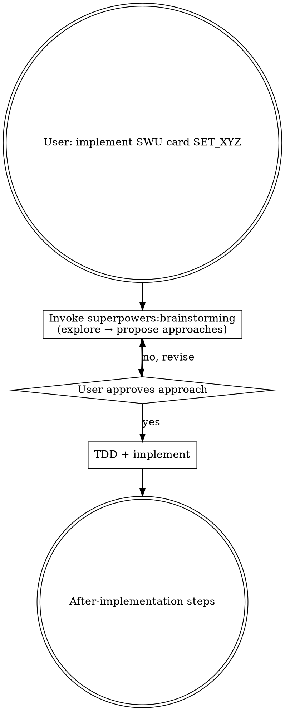
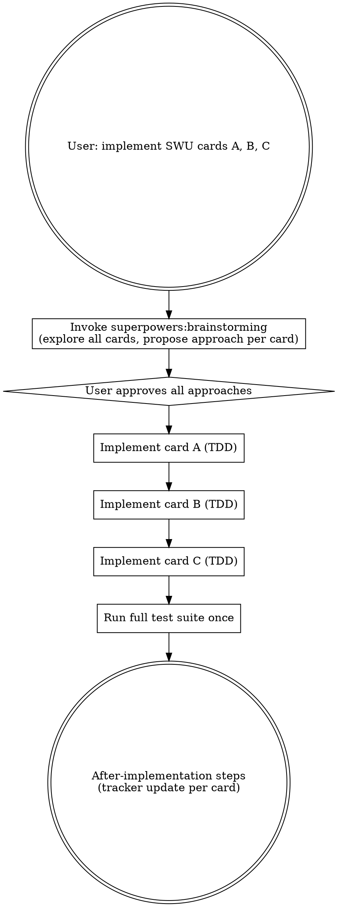

# Implement SWU Card

## Overview

When the user requests one or more SWU card implementations, explore each card's mechanics via brainstorming, pick an approach, then implement directly with TDD. Skip spec documents and plans — individual card implementations are small and follow established codebase patterns.

**Batch max: 5 cards per session.** If given more, implement the first 5 and tell the user to start a new session for the rest.

## Workflow

### Single card



### Batch (2–5 cards)

Brainstorm all cards upfront — propose an approach for each card in a single message, grouped by similarity where possible. User approves all (or revises individual ones). Then implement each card sequentially via TDD, running the full test suite once at the end.



## What to Skip

Once the user approves an approach — **stop the brainstorming checklist here**. This skill OVERRIDES the remaining brainstorming checklist steps. Do NOT:

- ~~Write a spec document~~ (`docs/superpowers/specs/...`)
- ~~Write an implementation plan~~ (`docs/superpowers/plans/...`)
- ~~Invoke `superpowers:writing-plans`~~

**Do instead:** Invoke `superpowers:test-driven-development` and implement.

## What "Implement Directly" Means (per card)

**Before writing any code**, use TodoWrite to create a task list that includes every card AND the tracker update step. Example for two cards:

```
[ ] Implement Card A (TDD)
[ ] Implement Card B (TDD)
[ ] Run full test suite
[ ] Mark Card A done in sor-implement.md
[ ] Mark Card B done in sor-implement.md
```

The tracker update task must be in the list from the start — not added later. This keeps it visible and prevents it from being skipped.

Then per card:

1. Add the card helper entry to `tests/card-helpers.ts` (if missing)
2. Write failing tests in `tests/unit/<set>/<card-title>.test.ts`
3. Implement the engine changes to make tests pass
4. **Update the Puzzles UI lists if the card has an activatable ability** — see the UI Registration gate below. This is required whenever the card is a Leader OR a non-leader unit with an `Action [...]` ability.
5. **Pass the Definition of Done gate below** (every clause of the card text → code + test) before considering the card complete
6. In a batch: proceed to next card. In a single: run full test suite now.

Follow the conventions in memory: card test files go in `tests/unit/<set>/`, named `<card-title>.test.ts`. Use `Cards.*` helpers — never raw card ID strings.

## UI Registration gate (activatable abilities)

The engine tests do **not** render the Puzzles UI, so a fully-wired, fully-tested activatable ability can still be invisible in-game because `src/containers/PuzzlesPage.tsx` keeps hand-maintained lists of which cards show an action button. These lists are duplicate registries of `ActionAbilities()` — nothing keeps them in sync, and `npm test` passes without the entry.

Check this predicate for every card, before marking it done:

- **Card is a Leader** with an activatable leader-side `Action [...]` ability → add its cardId to `LEADERS_WITH_ACTION_ABILITY` in `PuzzlesPage.tsx`.
- **Card is a non-leader unit** with an `Action [...]` ability → add `cardId: "<short button label>"` to `UNITS_WITH_ACTION_ABILITY` in `PuzzlesPage.tsx`.
- **Ability is only an automatic trigger** (When Played / When Defeated / On Attack / When Deployed / a keyword) → no UI entry needed; these fire on their own.

If the predicate matches and you did not touch `PuzzlesPage.tsx`, the card is **not done**. See memory: [[ui-leader-action-ability-set]].

## Definition of Done (completeness gate)

A card is **done only when you are ≥94% confident that every clause of its printed card text is both implemented AND covered by a unit test.** Do not mark it done, remove its tracker entry, or move to the next card until this gate passes.

That confidence is not a gut feeling — you earn it by enumeration, because partial implementations are invisible (a card can have one keyword wired and another clause entirely missing, and it still "looks" done):

1. **Re-read the full card text from the card-db** — pull it from the ability/`cardText` map in `src/server/engine/card-db/generated.ts` for the exact ID. Do not work from memory of the card.
2. **Split it into discrete clauses.** Each of these is a separate clause: every keyword (Saboteur, Sentinel, Shielded, Raid, Ambush, Overwhelm, Bounty…), every triggered ability ("When…", "On Attack", "When Defeated"), every activated/action ability, every conditional ("If…"), every optional ("You may…"), and every targeting restriction ("costs 2 or less", "non-leader", "in this arena").
3. **Map each clause to (a) a code path that implements it and (b) a test that exercises it.** For "may"/optional clauses, the test must cover *both* the accept and the decline branch. A granted keyword counts as a clause — confirm it's wired through its dictionary (e.g. `keyword-dictionaries.ts/`) AND has a test, not merely assumed.
4. **Account for ≥94% of the text this way.** The small remainder is only for genuinely non-executable flavor text. If any *mechanical* clause is unaccounted for, the card is **NOT done** — implement and test it, or surface it as an explicit blocker to the user. "The main ability works, the rest is an edge case" does not clear the gate.
5. **Clear the UI Registration gate above.** If the card is a Leader or a non-leader unit with an `Action [...]` ability, its cardId must be in the matching `PuzzlesPage.tsx` list. A green test suite does not clear this — the engine tests never render the UI.

State the clause→code→test mapping (briefly) when you report the card complete, so the coverage is visible rather than asserted.

## After Implementation

Check for a `<set>-implement.md` file in the project root — e.g., `SOR_105` → `sor-implement.md`. For each implemented card:

1. **Remove** the card's entire `###` entry block from its current section (e.g. "Unimplemented – COMPLEX").
2. **Update the summary table** at the top: increment `Implemented` by 1, decrement the card's prior status count (e.g. `Unimplemented – Complex`) by 1.

Do not just update the Notes text — the entry must be deleted and the counts must change. Mark the tracker todo complete.

**This step is not optional.** It was already in your TodoWrite list — check it off.

## Red Flags

- About to invoke `superpowers:writing-plans` or create a file under `docs/superpowers/` → stop, wrong path
- Given more than 5 cards → implement the first 5 only, tell user to continue in a new session
- Marking a card done after wiring only one of its abilities/keywords → not done; every clause needs code + test (see Definition of Done)
- Declaring done from memory of the card without re-reading its full text from `generated.ts` → re-read and enumerate clauses first
- Implemented a Leader or a unit with an `Action [...]` ability, tests pass, but never opened `PuzzlesPage.tsx` → the action button won't render in-game; add the cardId to the matching UI list (see UI Registration gate)
- "The main ability works, the rest is an edge case / flavor" → each mechanical clause is in scope, including optional "may" branches
- A card grants a keyword and you assumed it "just works" → verify it's wired through its dictionary and has a test
