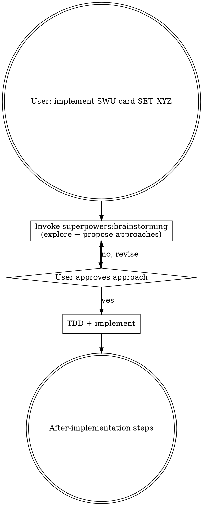
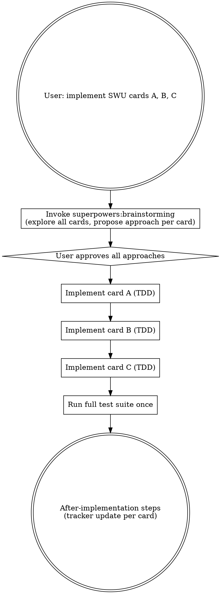

# Implement SWU Card

## Overview

When the user requests one or more SWU card implementations, explore each card's mechanics via brainstorming, pick an approach, then implement directly with TDD. Skip spec documents and plans — individual card implementations are small and follow established codebase patterns.

**Batch max: 5 cards per session.** If given more, implement the first 5 and tell the user to start a new session for the rest.

## Workflow

### Single card



### Batch (2–5 cards)

Brainstorm all cards upfront — propose an approach for each card in a single message, grouped by similarity where possible. User approves all (or revises individual ones). Then implement each card sequentially via TDD, running the full test suite once at the end.



## What to Skip

Once the user approves an approach — **stop the brainstorming checklist here**. This skill OVERRIDES the remaining brainstorming checklist steps. Do NOT:

- ~~Write a spec document~~ (`docs/superpowers/specs/...`)
- ~~Write an implementation plan~~ (`docs/superpowers/plans/...`)
- ~~Invoke `superpowers:writing-plans`~~

**Do instead:** Invoke `superpowers:test-driven-development` and implement.

## What "Implement Directly" Means (per card)

**Before writing any code**, use TodoWrite to create a task list that includes every card AND the tracker update step. Example for two cards:

```
[ ] Implement Card A (TDD)
[ ] Implement Card B (TDD)
[ ] Run full test suite
[ ] Mark Card A done in sor-implement.md
[ ] Mark Card B done in sor-implement.md
```

The tracker update task must be in the list from the start — not added later. This keeps it visible and prevents it from being skipped.

Then per card:

1. Add the card helper entry to `tests/card-helpers.ts` (if missing)
2. Write failing tests in `tests/unit/<set>/<card-title>.test.ts`
3. Implement the engine changes to make tests pass
4. In a batch: proceed to next card. In a single: run full test suite now.

Follow the conventions in memory: card test files go in `tests/unit/<set>/`, named `<card-title>.test.ts`. Use `Cards.*` helpers — never raw card ID strings.

## After Implementation

Check for a `<set>-implement.md` file in the project root — e.g., `SOR_105` → `sor-implement.md`. For each implemented card:

1. **Remove** the card's entire `###` entry block from its current section (e.g. "Unimplemented – COMPLEX").
2. **Update the summary table** at the top: increment `Implemented` by 1, decrement the card's prior status count (e.g. `Unimplemented – Complex`) by 1.

Do not just update the Notes text — the entry must be deleted and the counts must change. Mark the tracker todo complete.

**This step is not optional.** It was already in your TodoWrite list — check it off.

## Red Flags

- About to invoke `superpowers:writing-plans` or create a file under `docs/superpowers/` → stop, wrong path
- Given more than 5 cards → implement the first 5 only, tell user to continue in a new session
